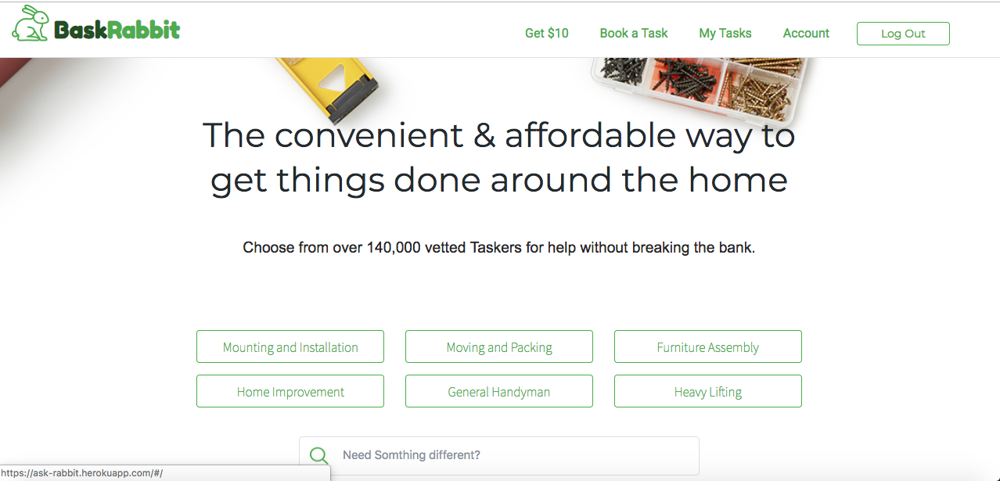

# README

* This README documents the steps necessary to get the application up and running.
* Welcome to BaskRabbit. BaskRabbit is a clone of TaskRabbit that will display a list of tasks and taskersand you can select a tasker of your choice to do your task.

* [BaskRabbit Live](https://ask-rabbit.herokuapp.com/#/)





##  Setup
* git clone the repo with the url: https://github.com/nathashas1/FULL-STACK
* gem install
* bundle install
* npm install
* bundle exec rails db:setup -to create database files and seed the database
* npm run start
* The project should then be available at the address localhost:3000 in your browser

## System dependencies
* Ruby version 2.5.1, NodeJS, and PostgreSQL version 10 installed on your machine
* Requires Install of NodeJS for node-package-manager (npm)
* The frontend is compiled with webpack that generates a dist/bundle.js file from the entrypoint file ./frontend/app.jsx.
  * The routes for this webpack configuration can be found in the webpack.config.js file
Functionality

## Functionality
* Users can Select tasks and give task information which will display a list of taskers.
Users can select their preferred person and assign tasks to them according to their availability.

## Code Samples
* Data persists at browser refresh.

```javascript
export const loadState = () => {
  try {
    const serializedState = localStorage.getItem('state');
    if (serializedState === null) {
      return {};
    }
    return JSON.parse(serializedState);
  } catch (err) {
    return {};
  }
};


export const saveState = (state) => {
  try {
    const serializedState = JSON.stringify(state);
    localStorage.setItem('state', serializedState);
  } catch (err) {
  }
};
```
